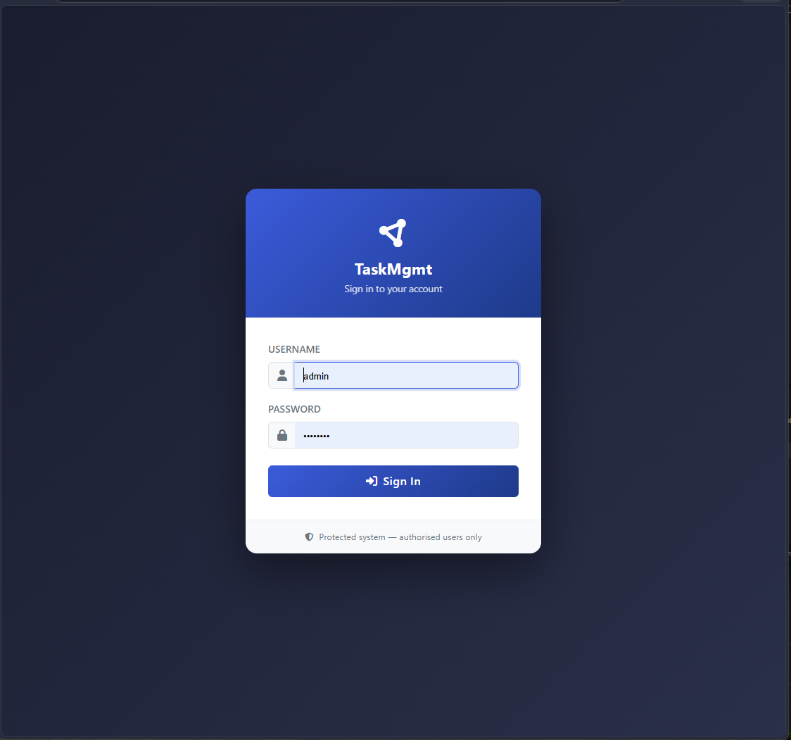
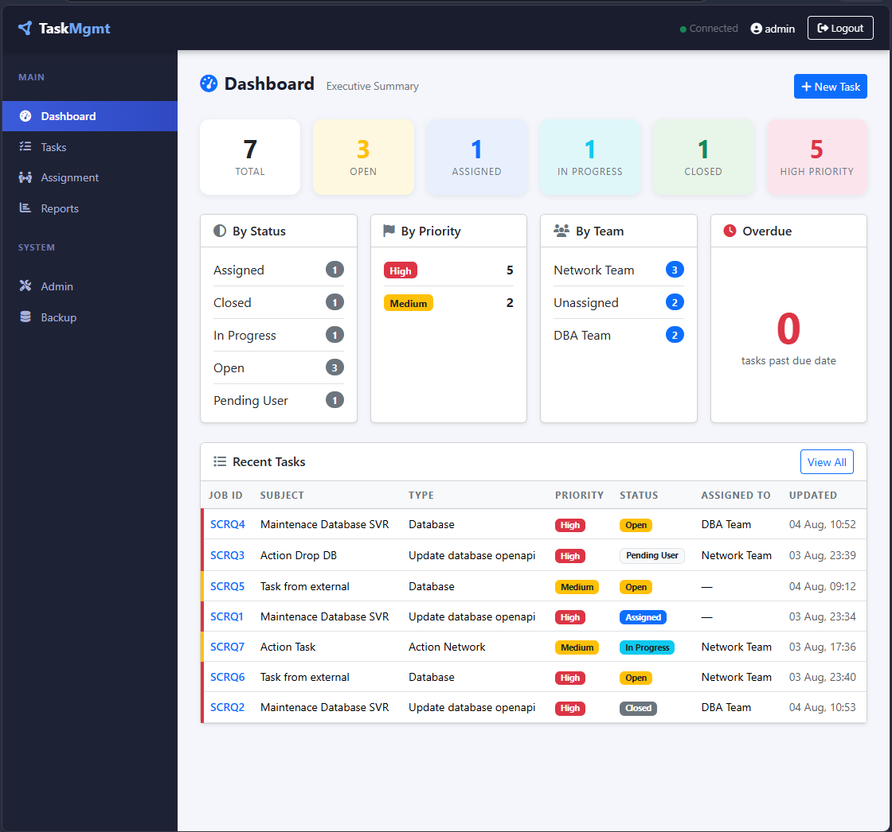
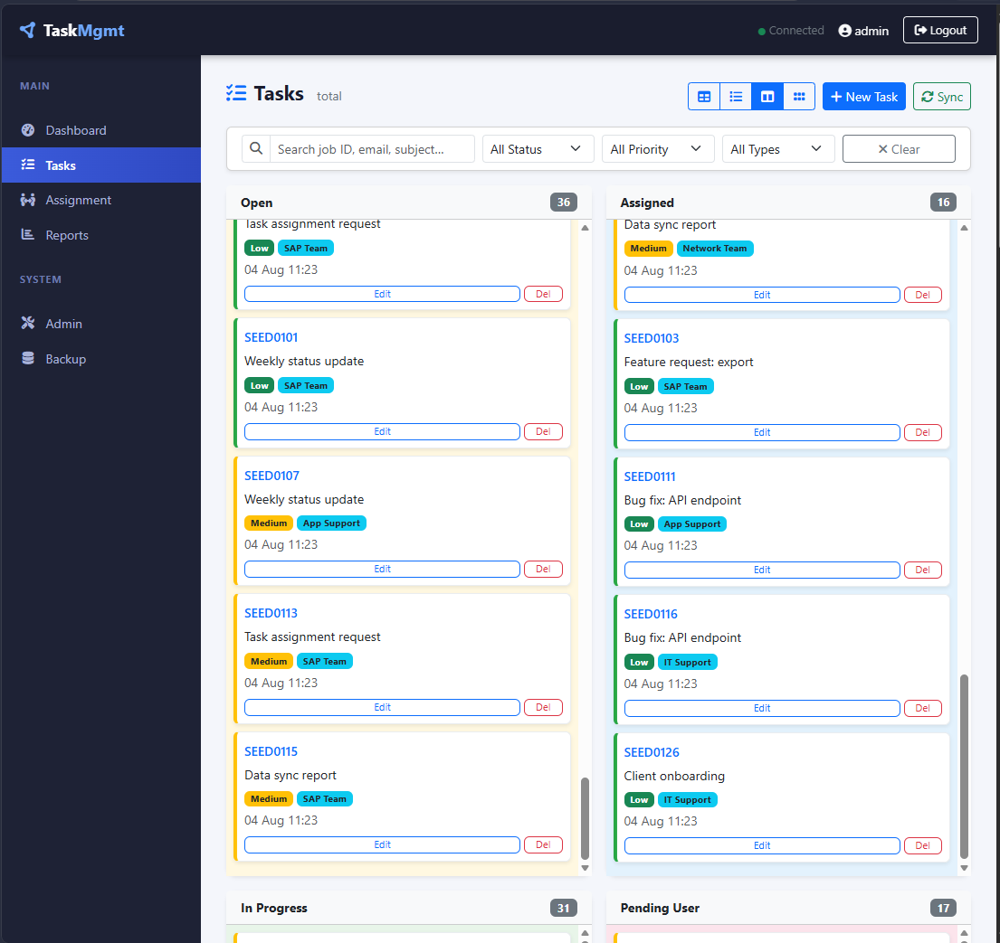
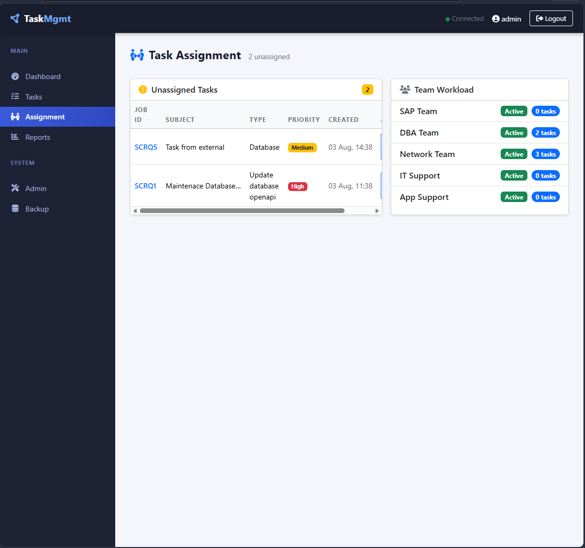
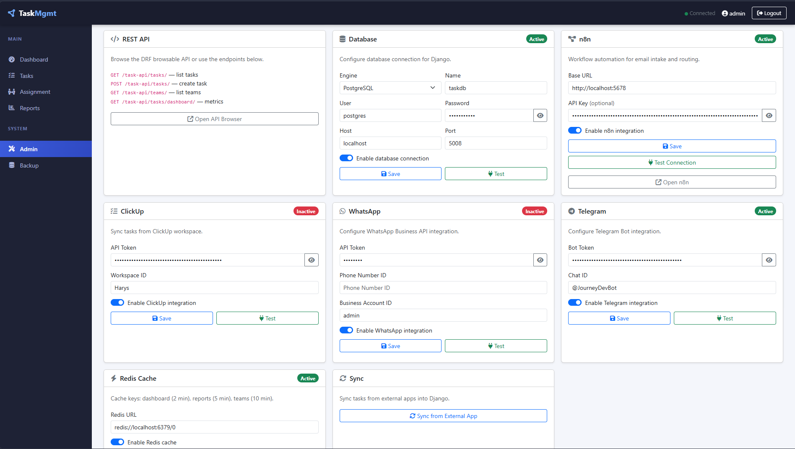
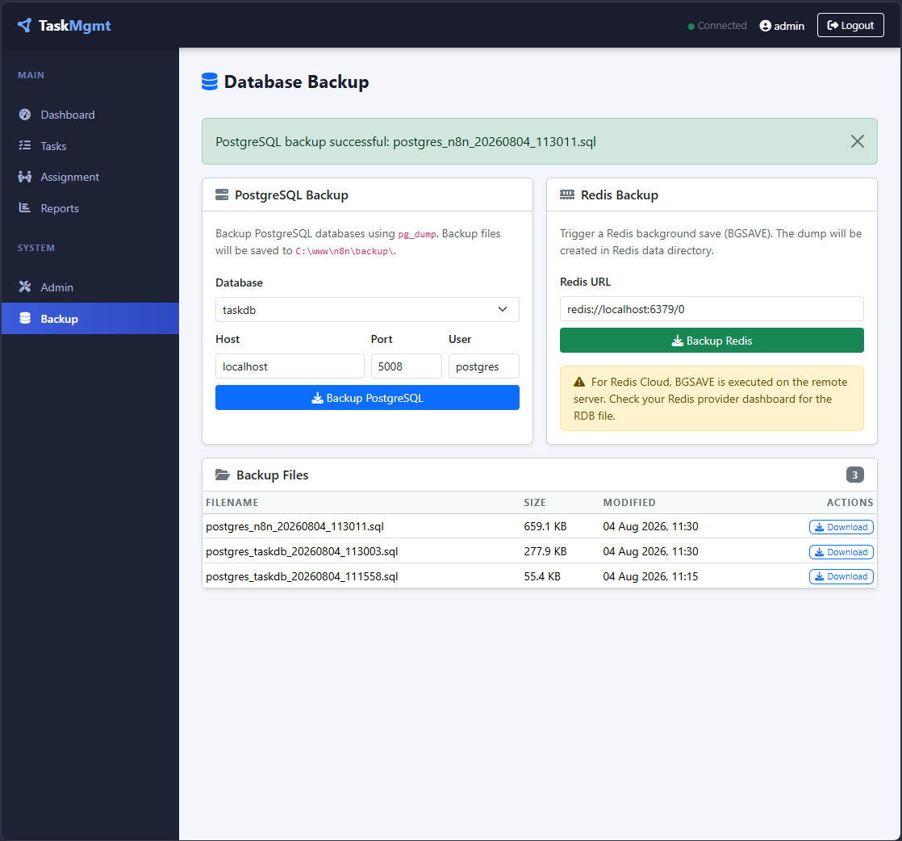

# Task Management Email Automation — n8n + Django + PostgreSQL + Redis

Panduan lengkap untuk membangun sistem otomasi email manajemen tugas menggunakan n8n, Django, PostgreSQL, dan Redis di Windows.

## Fitur

- **Task Management**: CRUD tasks dengan job ID otomatis sequential (XLS-YYYYMM0001, XLS-YYYYMM0002, ...), multi-view (table/board/list/card), search, filter, CSV/Excel import dengan preview
- **Email Integration**: Konfigurasi SMTP via admin page (Gmail, Outlook, SendGrid, dll) dengan test connection
- **n8n Integration**: Workflow automation dengan test connection di admin, webhook endpoint `/webhooks/n8n/`
- **ClickUp Integration**: Sync tasks dari ClickUp dengan API token tersimpan di database
- **Redis Cache**: URL Redis, aktif/nonaktif, test connection, start Redis lokal otomatis, flush cache — semua dikonfigurasi via admin page
- **Database Configuration**: Konfigurasi koneksi database (PostgreSQL/SQLite3) dengan test connection via admin page
- **Auto-Assignment Rules**: Keyword-based team assignment dengan UI CRUD di admin page
- **External App Sync**: Sync dari Email, Teams, ClickUp, WhatsApp, Telegram, Action Network, n8n via API/webhook
- **Action Network Integration**: Webhook endpoint `/webhooks/action-network/` dan test connection
- **Backup**: Backup PostgreSQL & Redis via UI di halaman `/backup/`
- **Data Analytics**: Target Name analytics di dashboard (database name, server, IP — dikelompokkan & ter-tag untuk report)
- **Django Admin**: Test connection buttons untuk semua config (Email, n8n, ClickUp, Redis, Database, WhatsApp, Telegram, Action Network)
 


<h1 align="center">Hi ✌️, I'm Harys Rifai</h1>
<h3 align="center">Problem-solving journey | Beginner developer from Jakarta</h3>
  </p>

<h2>💫 About Me</h2>

<p>
  Backend Developer and <strong>Database Architect</strong> with experience in building
  scalable, secure, and high-performance systems using <strong>Python</strong> and
  <strong>Django</strong>. Skilled in database architecture, data modeling, query optimization,
  API integration, real-time systems, and automation workflows.
</p>

<p>
  Experienced with <strong>PostgreSQL, IBM Db2, MariaDB, CynosDB, Redis, Oracle Database,
  and Microsoft SQL Server</strong>, focusing on performance tuning, indexing strategies,
  data migration, and enterprise-grade data solutions.
</p>

<p>
  Passionate about solving complex technical challenges and continuously expanding expertise in
  <strong>System Design, Distributed Systems, AI-Powered Automation, Cloud Infrastructure,
  and Scalable SaaS Architecture</strong>.
</p>


## 🌐 Socials:  [](https://linkedin.com/in/haris-rifai) [](mailto:harysrifai@gmail.com) 

# 💻 Tech Stack:
                                      
# 📊 GitHub Stats:
<br/>
<br/>


## 🏆 GitHub Trophies

 

https://github.com/harys-rifai

<!-- Proudly created with GPRM ( https://gprm.itsvg.in ) -->

```bash
git init
git add .
git commit -m "Initial commit"
git remote add origin https://github.com/harys-rifai/TaskMgmt-synchAPPS.git
git branch -M main
git push -u origin main
```

---

# 23. Screenshots

<div style="display:grid;grid-template-columns:repeat(3,minmax(0,1fr));gap:16px">

<div align="center">



**Login**

</div>

<div align="center">



**Dashboard**

</div>

<div align="center">



**Task Board**

</div>

<div align="center">



**Assignment**

</div>

<div align="center">



**Admin**

</div>

<div align="center">



**Backup**

</div>

</div>